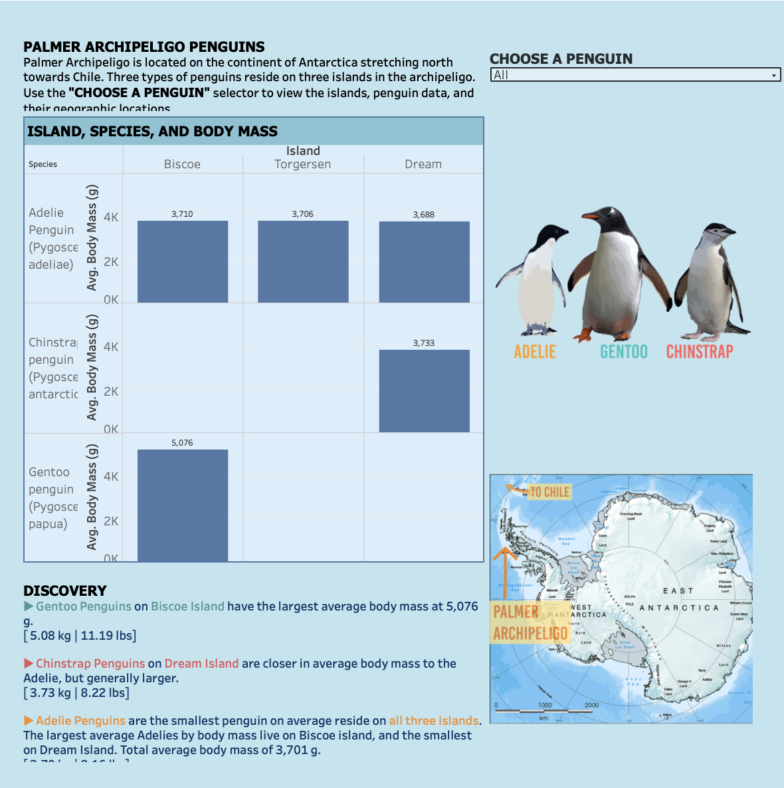

# Palmer-Archipelago-Penguins-Dashboards
A growing collection of interactive dashboards exploring penguin species in the Palmer Archipelago, Antarctica.

This project includes data visualizations built using multiple tools such as Tableau, Plotly, and Streamlit. It focuses on key metrics like species distribution, body mass, and geographic patterns among Gentoo, Chinstrap, and Adélie penguins.

## Tools Used
- Tableau Public (for geospatial and comparative dashboards)
- Plotly (upcoming interactive visualizations)
- Streamlit (planned web apps and data exploration tools)

## Dataset
Source: `penguins.Iter.csv` — a cleaned dataset representing species and island data from the Palmer Archipelago.

## Live Dashboards
- [View Tableau Dashboard](https://public.tableau.com/app/profile/lauren.schwartzenburg/viz/PalmerPenguinsAntarctica/DashboardMain?publish=yes)

## License
MIT License – free to use with attribution.

